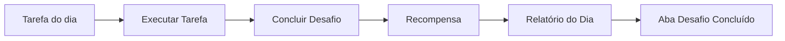

# Regra de Implementação - Modal de Dia FIRE 15D

## Visão Geral

O modal de cada dia do desafio FIRE 15D segue um fluxo estruturado com 3 estados de abas.

---

## Estrutura de Abas

### Estado Inicial (Dia não concluído)

| Aba | Visível | Descrição |
|-----|---------|-----------|
| Conteúdo do dia | ✅ | Conteúdo educacional, conceitos FIRE |
| Tarefa do dia | ✅ | Formulário/ações do dia |

### Estado Final (Dia concluído)

| Aba | Visível | Descrição |
|-----|---------|-----------|
| Conteúdo do dia | ✅ | Conteúdo educacional (read-only) |
| Desafio concluído | ✅ | Substitui "Tarefa do dia" |

---

## Fluxo de Execução



---

## Composição das Telas

### 1. Aba "Tarefa do dia"

**Componente**: `DayTaskTab.tsx`

**Conteúdo**:
- Título da tarefa
- Orientações passo a passo
- Formulário/componente customizado (ex: `Day1Form`, `Day2Stepper`)
- Botão "Concluir Desafio"

**Props**:
```typescript
interface DayTaskTabProps {
  dayId: number;
  config: DayConfig;
  onComplete: (values: Record<string, unknown>) => void;
  isLoading: boolean;
}
```

---

### 2. Tela "Recompensa" (Modal/Overlay)

**Componente**: `DayCelebrationModal.tsx` (já existe)

**Conteúdo**:
- Animação de celebração (confetti)
- Mensagem motivacional personalizada por dia
- Impacto real na vida do usuário
- Botão "Ver Relatório"

**Exemplo de mensagem**:
> "Parabéns! Este passo te ajuda a entender como você pensa sobre dinheiro. Isso vai te ajudar a criar um plano para mudar sua realidade financeira."

**Backend**: Tabela `days.reward_message` (nova coluna)

---

### 3. Aba "Desafio Concluído"

**Componente**: `DayCompletedTab.tsx` (novo)

**Seções**:

#### 3.1 Relatório do Dia
- KPIs relevantes do dia (vem de `outputMetrics`)
- Análise prática baseada nos dados inseridos
- Data/hora de conclusão

#### 3.2 Ações
- **Botão "Imprimir Relatório"**: Gera PDF do relatório
- **Botão "Editar Tarefa"**: Abre formulário em modo edição

**Props**:
```typescript
interface DayCompletedTabProps {
  dayId: number;
  progress: DayProgress;
  metrics: OutputMetricValue[];
  onEdit: () => void;
  onPrint: () => void;
}
```

---

## Alterações no Backend

### 1. Nova coluna na tabela `days`

```sql
ALTER TABLE days ADD COLUMN reward_message TEXT;
```

**Conteúdo**: Mensagem motivacional personalizada para cada dia.

### 2. Atualizar `day_progress`

Já possui campos necessários:
- `completed`: boolean
- `completed_at`: timestamp
- `form_data`: jsonb (dados do formulário)

---

## Alterações no Frontend

### 1. Atualizar `DayModal.tsx`

**Lógica de abas**:
```typescript
const tabs = useMemo(() => {
  const base = [{ id: 'conteudo', label: 'Conteúdo do dia' }];
  
  if (isCompleted) {
    base.push({ id: 'concluido', label: 'Desafio concluído' });
  } else {
    base.push({ id: 'tarefa', label: 'Tarefa do dia' });
  }
  
  return base;
}, [isCompleted]);
```

### 2. Criar `DayCompletedTab.tsx`

```
src/components/day/DayCompletedTab.tsx
```

**Estrutura**:
```tsx
export default function DayCompletedTab({ dayId, progress, metrics, onEdit, onPrint }) {
  return (
    <div className="space-y-6">
      {/* Relatório */}
      <Card>
        <CardHeader>
          <CardTitle>Relatório do Dia {dayId}</CardTitle>
          <p>Concluído em {formatDate(progress.completed_at)}</p>
        </CardHeader>
        <CardContent>
          {/* KPIs */}
          <div className="grid grid-cols-2 gap-4">
            {metrics.map(metric => (
              <MetricCard key={metric.key} {...metric} />
            ))}
          </div>
          
          {/* Análise */}
          <div className="mt-4 p-4 bg-muted rounded-lg">
            <h4>Análise do Dia</h4>
            <p>{generateDayAnalysis(dayId, progress.form_data)}</p>
          </div>
        </CardContent>
      </Card>
      
      {/* Ações */}
      <div className="flex gap-3">
        <Button variant="outline" onClick={onPrint}>
          <Printer className="mr-2 h-4 w-4" />
          Imprimir Relatório
        </Button>
        <Button variant="secondary" onClick={onEdit}>
          <Edit className="mr-2 h-4 w-4" />
          Editar Tarefa
        </Button>
      </div>
    </div>
  );
}
```

### 3. Criar helper `generateDayAnalysis`

```
src/lib/dayAnalysis.ts
```

Função que gera análise textual baseada nos dados do dia:

```typescript
export function generateDayAnalysis(dayId: number, formData: Record<string, unknown>): string {
  switch (dayId) {
    case 1:
      return generateDay1Analysis(formData);
    case 2:
      return generateDay2Analysis(formData);
    // ...
  }
}
```

### 4. Implementar impressão de relatório

```
src/lib/printReport.ts
```

Usa `html2pdf` ou `react-to-print` para gerar PDF.

---

## Checklist de Implementação

### Backend
- [ ] Adicionar coluna `reward_message` na tabela `days`
- [ ] Popular `reward_message` para cada dia via migration seed

### Frontend
- [ ] Criar `DayCompletedTab.tsx`
- [ ] Criar `DayTaskTab.tsx` (refatorar lógica existente)
- [ ] Atualizar `DayModal.tsx` com nova lógica de abas
- [ ] Criar `src/lib/dayAnalysis.ts`
- [ ] Criar `src/lib/printReport.ts`
- [ ] Atualizar `DayCelebrationModal.tsx` para usar `reward_message`

### Testes
- [ ] Fluxo: abrir modal → concluir tarefa → ver recompensa → ver relatório
- [ ] Editar tarefa após conclusão
- [ ] Imprimir relatório

---

## Arquivos Envolvidos

| Arquivo | Ação | Descrição |
|---------|------|-----------|
| `DayModal.tsx` | MODIFICAR | Nova lógica de abas |
| `DayCompletedTab.tsx` | CRIAR | Aba pós-conclusão |
| `DayTaskTab.tsx` | CRIAR | Aba de tarefa (refactor) |
| `DayCelebrationModal.tsx` | MODIFICAR | Usar reward_message |
| `dayAnalysis.ts` | CRIAR | Geração de análises |
| `printReport.ts` | CRIAR | Impressão PDF |
| `days` (Supabase) | MODIFICAR | Nova coluna |
